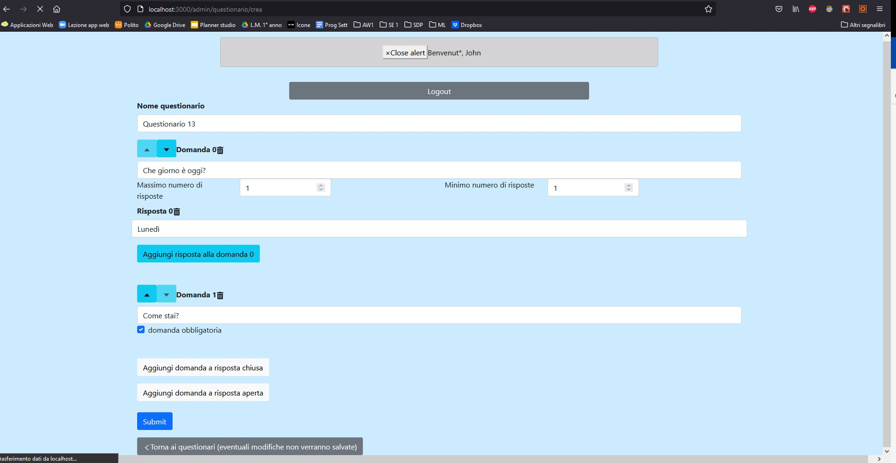

# Exam #1: "Questionario"
## Student: s282478 NATTA TOMMASO

## React Client Application Routes

- Route `/`: Pagina di login. Da qui ci si può loggare come admin oppure continuare come utilizzatore, senza effettuare il login
- Route `/admin`: Pagina contenente la lista dei questionari creati dall'admin. Da qui si può cliccare su uno specifico questionario per visualizzare le compilazioni o creare un nuovo questionario
- Route `/admin/questionario`: Pagina contenente le compilazioni fatte dagli utilizzatori per un singolo questionario.
- Route `/admin/questionario/crea`: Pagina di creazione del questionario
- Route `/utilizzatore`: Pagina contenente la lista di tutti i questionari dell'applicazione, resi disponibili per la compilazione da perte dell'utilizzatore.
- Route `/utilizzatore/questionario`: Pagina per la compilazione di un singolo questionario.

## API Server

Anche se è un'informazione ridondante, per eccesso di zelo anche per tutte le get è specificato che non è richiesto un body.

- POST `/api/sessions`
  - descrizione: dati username e password effettua la login 
  - request parameters: NONE
  - request body content: 
   { username: "john.doe@polito.it", 
   password: "password" }
  - response body content:
  { id: 1, 
  username: "john.doe@polito.it", 
  name: "John" }
- DELETE `/api/sessions/current`
  - descrizione: effettua il logout
  - request parameters: NONE
  - request body content: NONE
  - response body content: NONE
- GET `/api/sessions/current`
  - descrizione: ritorna i dati dell'utente se è correttamente loggato
  - request parameters: NONE
   - request body content: NONE
  - response body content: 
        { id: 1, 
        username: "john.doe@polito.it", 
        name: "John" }
- GET `/api/admin/questionari`
  - descrizione: dato l'id dell'admin, ritorna la lista dei questionari dell'admin
  - request parameters: ?user_id=1
   - request body content: NONE
  - response body content: 
  [{"id":1,"titolo":"ti piacciono i gatti?","nCompilazioni":2,"user":1},
  {"id":2,"titolo":"Ti piace il calcio?","nCompilazioni":2,"user":1},
  {"id":5,"titolo":"ds","nCompilazioni":0,"user":1},{"id":6,"titolo":"Ti piace la pasta?","nCompilazioni":1,"user":1}]
- GET `/api/admin/compilazioni`
  - descrizione: dato l'id dell'admin e l'id del questionario, ritorna la lista delle compilazioni effettuate dai vari utilizzatori (senza le risposte alle domande)
  - request parameters: ?user_id=1&quest_id=2
   - request body content: NONE
  - response body content: 
  [{"id":1,"user":1,"questionario":1,"nomeUtilizzatore":"Marcello"},{"id":2,"user":1,"questionario":1,"nomeUtilizzatore":"Ornella"}]
- GET `/api/admin/domandeQuestionario`
  - descrizione: dato l'id del questionario e l'id della compilazione, ritorna la lista delle domande della compilazione e delle relative risposte selezionate
  - request parameters: ?comp_id=1&quest_id=2
   - request body content: NONE
  - response body content:
  [{"id":1,"testoDomanda":"Spiega che cos'è il fuorigioco","compilazione":1,"questionario":2,"chiusa":"0","rispostaSelezionata":null,"rispostaAperta":"Quando la palla viene passata troppo presto"},{"id":2,"testoDomanda":"Quali sono le squadre più vincenti del campionato?","compilazione":1,"questionario":2,"chiusa":"1","rispostaSelezionata":"0,1,5,6","rispostaAperta":null},{"id":3,"testoDomanda":"Hai mai giocato a calcio?","compilazione":1,"questionario":2,"chiusa":"1","rispostaSelezionata":0,"rispostaAperta":null}]
- GET `/api/admin/risposteQuestionario`
  - descrizione: dato l'id del questionario, l'id dell'amministratore e l'id di una domanda chiusa, ritorna la lista delle possibili risposte alla domanda chiusa separate da virgola
  - request parameters: ?quest_id=1&user_id=1&dom_id=3
   - request body content: NONE
  - response body content: stringa contenente le varie risposte alla domanda separate da virgola
  [{"risposte":"1,2,3,+ di 3"}]
- POST `/api/admin/questionari`
  - descrizione: dato il titolo del questionario e l'id dell'admin che l'ha creato inserisce il nuovo questionario nel DB
  - request parameters: NONE
   - request body content: { titolo: 'gf', user_id: 1 }
  - response body content: { 1}
- POST `/api/admin/domandeQuestionario`
  - descrizione: riceve in input i dati della domanda di un questionario appena creato e inserisce la domanda del questionario nel DB
  - request parameters: NONE
   - request body content: {
  dId: 0,
  domanda: 'Ti piacciono?',
  risposte: [ 'Sì', 'No' ],
  chiusa: true,
  maxR: 1,
  minR: 1,
  qId: 10,
  user_id: 1
    }
  - response body content: NONE
- POST `/api/utilizzatore/questionari`
  - descrizione: dato l'id del questionario e l'id dell'admin che l'ha creato incrementa di uno il numero di compilazioni e ritorna il numero aggiornato
  - request parameters: NONE
   - request body content: {
      q_id : 1,
      user_id : 1
    }
  - response body content:
  { 4 }
- GET `/api/utilizzatore/questionari`
  - descrizione: ritorna la lista di tutti i questionari compilabili da un utilizzatore (i.e. tutti quelli a DB)
  - request parameters: NONE
   - request body content: NONE
  - response body content: 
  [{"id":1,"titolo":"ti piacciono i gatti?","nCompilazioni":2,"user":1},{"id":2,"titolo":"Ti piace il calcio?","nCompilazioni":2,"user":1},{"id":3,"titolo":"Cosa ti piace fare nel tempo libero?","nCompilazioni":2,"user":0},{"id":4,"titolo":"Sei un artista?","nCompilazioni":2,"user":0},{"id":5,"titolo":"ds","nCompilazioni":0,"user":1},{"id":6,"titolo":"Ti piace la pasta?","nCompilazioni":1,"user":1}]
- GET `/api/utilizzatore/domande`
  - descrizione: dato l'id del questionario ritorna la lista delle domande del questionario e delle possibili risposte alle stesse 
  - request parameters: ?quest_id=1
   - request body content: NONE
  - response body content: 
  [{"dId":0,"qId":1,"userId":1,"domanda":"hai mai avuto un gatto?","risposte":"Sì,No","chiusa":"1","maxR":1,"minR":1,"obbligatoria":null},{"dId":1,"qId":1,"userId":1,"domanda":"Ti piacciono gli animali?","risposte":"","chiusa":"0","maxR":null,"minR":null,"obbligatoria":0},{"dId":2,"qId":1,"userId":1,"domanda":"Ti piacciono i gatti?","risposte":"","chiusa":"0","maxR":null,"minR":null,"obbligatoria":1},{"dId":3,"qId":1,"userId":1,"domanda":"Se hai avuto un gatto, quante volte gli davi da mangiare al giorno?","risposte":"1,2,3,+ di 3","chiusa":"1","maxR":1,"minR":0,"obbligatoria":null}]
- POST `/api/utilizzatore/compilazioni`
  - descrizione: dato il nome dell'utilizzatore, l'id del questionario e l'id dell'admin che lo ha creato inserisce la compilazione a DB e ne ritorna l'identificativo
  - request parameters: NONE
   - request body content: { nome: 'Tommaso', qId: 9, user: 1 }
  - response body content: restituisce l'id della compilazione
  { 4 }
- POST `/api/utilizzatore/domande`
  - descrizione: dato l'id della compilazione, l'id del questionari e l'id dell'admin che lo ha creato inserisce la domanda del questionario ed il modo in cui è stata compilata dall'utilizzatore, restituendone l'id
  - request parameters: NONE
   - request body content: {
  user: 1,
  compilazione: 3,
  questionario: 1,
  testo_domanda: 'Se hai avuto un gatto, quante volte gli davi da mangiare al giorno?',
  chiusa: '1',
  risposta_selezionata: [ '1' ]
}
  - response body content: 
  { 1 }

## Database Tables

- Table `users` - contiene gli admin dell'applicazione, quelli che possono creare i questionari. campi: id, email, name, hash
- Table `questionari` - contiene i questionari dell'applicazione. campi: id, titolo, nCompilazioni, user
- Table `domande_questionari_vuote` - contiene le domande NON compilate (vuote) dei questionari. campi d_id, q_id, user_id, domanda, risposte, chiusa, maxR, minR, obbligatoria
- Table `domande_questionari` - contiene le compilazioni della singola domanda del singolo questionario fatte dagli utilizzatori. campi: id, user, compilazione, questionario, testo_domanda, chiusa, risposta_selezinata, rispostaAperta
- Table `compilazioni` - contiene l'elenco delle compilazioni fatte dai vari utilizzatori ai vari questionari. campi: id, user, questionario, nome_utilizzatore

## Main React Components

- `LoginForm` (in `LoginForm.js`): gestire la login. presenta un form in cui inserire i dati
- `LogoutButtonAndWelcomeUser` (in `LoginForm.js`): gestire il logout. Presenta un pulsante tramite cui sloggarsi e un pop-up con la scritta "Welcome <nome utente>" quando si è loggati
- `ListaRisposte` (in `ListaRisposte.js`): Serve all'admin a visualizzare le risposte fornite ad un questionario. Lista le risposte fornite dall'utente e permette la navigazione tra una compilazione e l'altra
- `ListaQuestionari` (in `ListaQuestionari.js`): usata sia da admin sia da utilizzatore per visualizzare i questionari disponibili. Permette all'admin di passare alla visualizzazione delle compilazioni e all'utilizzatore di passare alla compilazione del questionario
- `CreaQuestionario` (in `CreaQuestionario.js`): Permette all'admin la creazione del questionario. Visualizza un form in cui inserire il nome del questionario e le domande (aggiungibili tramite appositi pulsanti)
- `CompilaQuestionario` (in `CompilaQuestionario.js`): permette all'utilizzatore di compilare il questionario. Presenta un form con la lista delle domande e la possibilità di rispondere. 
- `ButtonNuovoQuestionario` (in `ButtonNuovoQuestionario.js`): Bottone che permette all'admin di passare alla schermata di creazione di un nuovo questionario.
- `BackButton` (in `BackButton.js`): Bottone che permette all'utilizzatore e all'admin ti tornare alla lista dei questionari quando si trovano rispettivamente in fase di compilazione o di creazione del questionario

(only _main_ components, minor ones may be skipped)

## Screenshot

Creazione di un questionario

## Users Credentials

- username: "john.doe@polito.it", password: "password" 
- username: "tommaso.natta@gmail.com, password: "natta" 
